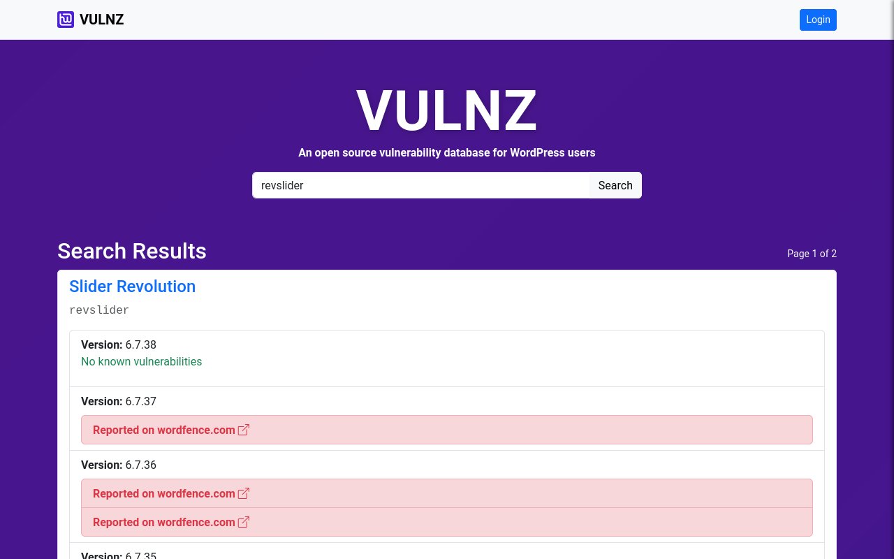

# VULNZ

Self-hosted vulnerability database for WP plugins and themes. The database is primarlly accessed through an API, and there is a UI for basic admin tasks.

The application pulls from wordpress.org for plugin & theme meta data. We don't store details about each vulnerability - only link(s) to the original disclosure URL(s).

This can best be thought of as a vulnerability metabase.



## Who is this for?

The app is designed to help WordPress hosting providers collate and manage WP plugin vulnerabilities across their clients' sites. If your VULNZ installation to be publically accessible, you can host it behind a reverse-proxy and manage your SSL in Apache/Nginx.

## Requirements

- MySQL/MariaDB: Any recent version should be fine.
- BASH: Required if you want to use the tools to backup, restore and pull from wordfence.com.
- Node: Any recent LTS should be fine. Tested with Node v22.21.0

## Self-Hosting

1.  **Clone the repository:**

    ```bash
    git clone https://github.com/headwalluk/vulnz
    cd vulnz
    ```

2.  **Install dependencies:**

    ```bash
    npm install
    ```

3.  **Configure your environment:**
    - Copy `env.sample` to `.env`:
      ```bash
      cp env.sample .env
      ```
    - Edit the `.env` file and set up your MySQL/MariaDB database credentials.

4.  **Initial Setup (Setup Mode):**
    - In your `.env` file, set `SETUP_MODE=true`.
    - Start the application:
      ```bash
      npm run start
      ```
    - Open your browser and navigate to the application (e.g., `http://localhost:3000`).
    - Register a new user account. This first account will automatically be granted administrator privileges.

5.  **Switch to Production Mode:**
    - **IMPORTANT:** After creating your administrator account, stop the application and change `SETUP_MODE` to `false` in your `.env` file. This is a critical security step to ensure that subsequent user registrations do not receive administrator privileges.
    - You can also choose to disable new user registrations entirely by setting `REGISTRATION_ENABLED=false`.

6.  **Restart the application:**
    ```bash
    npm run start
    ```

## Populating the Database

The database will be empty initially. You will need to use the API to add websites, components, and vulnerabilities.

We will be adding scripts and tools to pull from several public vulnerability databases soon. We will also release a WordPress plugin in the near future, which will link to the app via the API to automate website and component tracking.

### Example API Usage

If you're running vulnz on a localhost on port 3000 (the defaults) and you have [HTTPie](https://httpie.io/) installed:

```bash
# Our request body.
BODY='{"urls": [ "https://a-security-website/news/security-hole-found-in-woo-1-2-3/" ] }'

# POST to our locally hosted VULNZ API.
echo "${BODY}" | http POST http://localhost:3000/api/components/wordpress-plugin/woocommerce/1.2.3 \
   "X-API-Key: YOUR_API_KEY"
```
